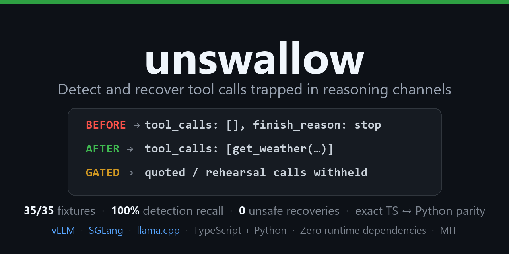

<h1 align="center">unswallow</h1>

<p align="center">
  <em>The model called the tool. The server returned nothing. Your agent moved on.</em>
</p>

<p align="center">
  
  
  <a href="https://github.com/0DukePan/unswallow/actions/workflows/ci.yml"></a>
  
  
  
  
</p>

<p align="center">
  <strong>35/35 pinned fixtures &middot; 100% detection recall &middot; 0 unsafe recoveries &middot; 0 false negatives &middot; 0 runtime dependencies</strong><br>
  <sub>Measured on a 35-fixture adversarial corpus (11 genuine swallows, 19 non-executable cases, 200 seeded synthetic negatives) and rerunnable on your hardware. The corpus is small and adversarial on purpose — these are regression counts over documented examples, not population estimates. Method and raw results: <a href="packages/bench/results/results.md">correctness</a> &middot; <a href="packages/bench/results/fp-results.md">safety</a> &middot; <a href="packages/bench/perf/results.md">performance</a> &middot; <a href="docs/false-positives.md">methodology</a>.</sub>
</p>

<p align="center">
  
</p>

---

No crash. No error. No log line. Just `HTTP 200`, `finish_reason: stop`, and `tool_calls: []` — your agent reads "the model chose not to act" and silently stops mid-task.

The call is sitting, fully formed, in the wrong channel: `reasoning` / `reasoning_content` / `thinking`. The server's parser never looked there. unswallow finds it, checks whether the model actually meant it, and puts it back — one function, zero runtime dependencies, ~0.1 ms on realistic payloads.

Works against **vLLM, SGLang, and llama.cpp** swallow shapes, with a sourced engine/version matrix that tracks where the bug is live.

## Before / after

```jsonc
// what your server sent
{ "finish_reason": "stop", "tool_calls": [] }

// what was buried in message.reasoning, fully formed
<tool_call><function=Finish><parameter=answer>204</parameter></function></tool_call>

// what your handler gets back
{ "finish_reason": "tool_calls",
  "tool_calls": [{ "function": { "name": "Finish", "arguments": "{\"answer\": 204}" } }] }
```

```ts
import { checkAndRescue } from 'unswallow';

const result = checkAndRescue(rawProviderResponse, {
  engineHint: 'vllm',        // 'vllm' | 'sglang' | 'llama.cpp' — matrix-aware confidence
  engineVersion: '0.19.0',   // server version, same reason
  toolSchemas: myTools,      // optional: validates names/arguments before recovery
});

if (result.recovered && result.recoveredResponse) {
  return result.recoveredResponse;  // tool_calls populated, finish_reason fixed
}
```

One call in your response path. The original object is never mutated (recovery returns a deep copy); clean responses pass through untouched with `confidence: 0`.

<p align="center">
  
</p>

## The bug class

Reasoning models emit their tool calls **before** closing the think block — "reasoning about which tool to call" and "calling it" blur together during generation. Server-side parsers split on the closing think tag and route everything before it into `reasoning`. Downstream tool-call parsing only inspects `content`. The call never reaches the tool parser.

It isn't malformed. It isn't in the wrong dialect. It's syntactically perfect, sitting in the wrong field — and the response looks exactly like a deliberate non-action. Every other tool-call failure fails loudly (bad JSON throws, unknown names are visible in raw text); this one returns a valid, well-formed response that reads as "no tool call".

| Pattern | What happens | Confirmed example |
| --- | --- | --- |
| **A — Trapped inside** | Tool call fully contained inside the reasoning block; parser never sees it | [vLLM #39056](https://github.com/vllm-project/vllm/issues/39056) (Qwen3.5-35B-A3B-FP8), [SGLang #30744](https://github.com/sgl-project/sglang/issues/30744), [llama.cpp #20837](https://github.com/ggml-org/llama.cpp/issues/20837) |
| **B — Trailing after** | Tool call lands in `content`, but reasoning text is appended right after the JSON, breaking strict `JSON.parse` | [pi #952](https://github.com/earendil-works/pi/issues/952) (Kimi-K2-Thinking) |
| **C — Field leak** | Reasoning tags/content leak into the wrong field mid-stream (detection-only) | MiniMax M3 `<mm:think>` streaming leak |
| **D — History drift** | Reasoning tags leak into history; the model starts imitating fake thinking tags on later turns (prevention: `sanitizeHistory`) | [open-webui #23339](https://github.com/open-webui/open-webui/issues/23339) |

<details>
<summary><strong>Why <code>finish_reason: stop</code> misleads — and context loss vs. a swallowed call</strong></summary>

The swallow *is* the model's final decision — it emitted the call and stopped. `stop` describes generation termination, not intent, so a stopped turn with empty `tool_calls` looks identical to a turn where the model genuinely chose not to act.

That is different from **context loss**: if no envelope exists in any channel, the missing call is a harness/context problem (history truncation, wrong template, dropped turn), and unswallow will correctly find nothing. It only heals a call that is *present but stranded* — the `adv-context-loss` fixture pins that boundary.

And valid JSON is not intent: a byte-complete envelope can be an illustration, a rehearsal, a quoted example, or an explicitly retracted call. The [intent guard](docs/intent-guard.md) withholds recovery on that evidence while still surfacing the candidate.

</details>

## How it works

```
raw provider response + optional engine hint + optional tool schemas
        │
   ① Channel scan      reasoning / reasoning_content / thinking / content,
                        plus think-blocks embedded in content
        │
   ② Envelope extract  structurally complete tool-call envelopes:
                        <tool_call>…</tool_call>, <function=name>…</function>,
                        or balanced JSON with name + arguments
        │
   ③ Classify          A: trapped inside reasoning · B: trailing text after JSON
                        in content · C: reasoning-tag leak (detection-only)
        │
   ④ Intent gate      per-envelope evidence: position vs. the channel boundary,
                        negation/quotation/retraction cues, schema/name validity,
                        agent state, side-effect policy → category + blocked[]
        │
   ⑤ Recover           rebuild tool_calls[] from the gate-passing subset
                        (deep copy), set finish_reason: tool_calls
        │
   ⑥ Confidence        matrix hit → 0.95 · heuristic fallback → 0.55 · nothing → 0,
                        with warnings[] explaining exactly why
```

**A wrong recovery is worse than the silent failure it replaces.** Recovery is never a keyword match: it requires a *structurally complete* envelope, and then the [intent guard](docs/intent-guard.md) withholds recovery on deterministic evidence against execution — an explicit "do not execute", a quoted/reported/retracted call, a mid-thought draft followed by more reasoning, arguments that violate a supplied schema, a name absent from the declared tools, `expectToolCall: false`, or a name in `sideEffectingTools`. Detection still reports the candidate (`category`, `intent.blocked[]`); only the executable claim is withheld. All of it is pinned in the adversarial corpus (`fp-guard-*`, `adv-*`) — neither guard can regress silently. Methodology: [`docs/false-positives.md`](docs/false-positives.md).

## Benchmarks

Every layer is independently rerunnable on your own hardware — the full repro guide (commands, methodology notes, Linux reference numbers) is in [`docs/benchmarks.md`](docs/benchmarks.md). Latest runs: 2026-09-18.

| metric | value |
| --- | --- |
| detection recall (genuine swallows found) | **100%** (11/11) |
| **unsafe recovery rate** (non-executable cases recovered) | **0%** (0/19) — any nonzero value fails CI |
| recovery precision (intended ÷ all recovered calls) | **100%** |
| reconstruction (recovered calls == `expectedCalls`) | **12/12** |
| detection false positives (candidates flagged) | 7/19 (36.8%) — reported, not gated |
| seeded synthetic negatives | 0/200 fired |
| check latency, small reasoning payload / 1 MB block | ~0.11 ms / ~1.8 ms (TS) · ~0.30 ms / ~1.0 ms (Python) |
| TS ↔ Python parity | 35/35, exact confidence and category equality |

The detection false positives are the quoted/rehearsal/malformed candidates: detection surfaces them with a `category`, and the gate withholds recovery. The corpus is adversarial and small — regression counts over documented examples, not population estimates.

<details>
<summary><strong>Full fixture corpus (35 rows, per-fixture results)</strong></summary>

Hash-pinned and byte-checked against `packages/bench/fixtures.sha256` before every run, so results cannot silently drift. `sourced: yes` = reconstructed from the linked upstream report; `synthetic` = constructed/adversarial (its `source` field says so); live captures are marked. Every fixture also carries a ground-truth label (`groundTruth.classification` / `recoverable`) kept separate from its detector expectation.

| id | engine | version | expected | actual | recovered | confidence | sourced | status |
| --- | --- | --- | --- | --- | --- | --- | --- | --- |
| vllm-qwen3.5-0.19-pattern-a | vllm | 0.19.0 | A | A | yes | 0.95 | yes | PASS |
| vllm-qwen3.5-0.19-pattern-a-parallel | vllm | 0.19.0 | A | A | yes (2) | 0.95 | synthetic | PASS |
| vllm-qwen3.5-0.19-pattern-a-duplicate | vllm | 0.19.0 | A | A | yes (1) | 0.95 | synthetic | PASS |
| vllm-qwen3-0.19-pattern-a-json-envelope | vllm | 0.19.0 | A | A | yes | 0.95 | yes | PASS |
| vllm-qwen3-0.19-tool-choice-required-pattern-b | vllm | 0.19.0 | B | B | yes | 0.55 | yes | PASS |
| vllm-qwen3-0.23-pattern-a-partial | vllm | 0.23.4 | A | A | yes | 0.80 | yes | PASS |
| vllm-qwen3-0.24-clean | vllm | 0.24.0 | none | none | no | 0.00 | yes | PASS |
| vllm-qwen3.5-0.19-streaming-pattern-a | vllm | 0.19.0 | A | A | yes | 0.95 | yes | PASS |
| sglang-qwen3.5-reasoning-content-pattern-a | sglang | 0.4.6 | A | A | yes | 0.95 | yes | PASS |
| llamacpp-b8461-qwen3.5-9b-multiturn-pattern-a | llama.cpp | b8461 | A | A | yes | 0.95 | yes (live) | PASS |
| llamacpp-b8461-qwen3.5-9b-streaming-multiturn-pattern-a | llama.cpp | b8461 | A | A | yes | 0.95 | yes (live) | PASS |
| llamacpp-qwen3.5-thinking-pattern-a | llama.cpp | b8461 | A | A | yes | 0.95 | yes | PASS |
| pi-kimi2-pattern-b | — | — | B | B | yes | 0.55 | yes | PASS |
| pi-kimi2-streaming-pattern-b | — | — | B | B | yes | 0.55 | yes | PASS |
| minimax-m3-pattern-c-leak | — | — | C | C | no | 0.50 | synthetic | PASS |
| minimax-m3-streaming-pattern-c-leak | — | — | C | C | no | 0.50 | synthetic | PASS |
| deepseek-reasoning-content-pattern-a | sglang | 0.4.6 | A | A | yes | 0.95 | synthetic | PASS |
| fp-guard-discussion-only | vllm | 0.19.0 | none | none | no | 0.00 | synthetic | PASS |
| fp-guard-partial-json | vllm | 0.19.0 | none | none | no | 0.00 | synthetic | PASS |
| fp-guard-json-array-args | vllm | 0.19.0 | none | none | no | 0.00 | synthetic | PASS |
| fp-guard-json-string-args | vllm | 0.19.0 | none | none | no | 0.00 | synthetic | PASS |
| fp-guard-multiple-partial | vllm | 0.19.0 | none | none | no | 0.00 | synthetic | PASS |
| fp-guard-user-content-mention | vllm | 0.19.0 | none | none | no | 0.00 | synthetic | PASS |
| fp-guard-xml-empty-name | vllm | 0.19.0 | none | none | no | 0.00 | synthetic | PASS |
| adv-quoted-complete-negated | vllm | 0.19.0 | A | A | no | 0.95 | synthetic | PASS |
| adv-quoted-report-context | vllm | 0.19.0 | A | A | no | 0.95 | synthetic | PASS |
| adv-rehearsal-mid-reasoning | vllm | 0.19.0 | A | A | no | 0.95 | synthetic | PASS |
| adv-retraction-after-call | vllm | 0.19.0 | A | A | no | 0.95 | synthetic | PASS |
| adv-narration-content | vllm | 0.19.0 | B | B | no | 0.55 | synthetic | PASS |
| adv-mixed-genuine-rehearsed | vllm | 0.19.0 | A | A | yes (1/2) | 0.95 | synthetic | PASS |
| adv-malformed-args-vs-schema | vllm | 0.19.0 | A | A | no | 0.48 | synthetic | PASS |
| adv-unknown-tool-name-vs-schema | vllm | 0.19.0 | A | A | no | 0.48 | synthetic | PASS |
| adv-multiple-json-objects | vllm | 0.19.0 | none | none | no | 0.00 | synthetic | PASS |
| adv-discussion-incomplete | vllm | 0.19.0 | none | none | no | 0.00 | synthetic | PASS |
| adv-context-loss | vllm | 0.19.0 | none | none | no | 0.00 | synthetic | PASS |

Regenerate with `npm run bench`; verified read-only in CI (`npm run bench:check`), which also lints ground-truth coherence and checks recovered calls against `expectedCalls`. Every fixture is cross-checked against its engine matrix row: flip a row to a different behavior and the matching fixture must flip too, or CI fails.

</details>

<details>
<summary><strong>Performance (TS + Python, Windows run) and the naive-baseline comparison</strong></summary>

`npm run bench:perf` — seeded, deterministic corpus; warm latencies, p50/p95/p99, throughput, retained heap per call (`--expose-gc`). Every scenario runs 5 full passes (3 for async); percentiles are pooled across runs, the reported mean is the median of the per-run means, and the per-run min–max spread is in parentheses. Both reports print the same corpus sha256 (`3066ff5a…`) — the mechanical check behind "same seeds, same payloads". The intent gate added a measured ~1.0 ms (TS) / ~0.3 ms (Python) to the 1 MB path, inside the `bench:probe` ceiling.

*Node v22.16.0 · AMD Ryzen 5 2600X (12 cores) · 15.9 GB RAM · win32 x64*

| scenario | payload | p50 / p95 / p99 | mean (min–max) | throughput |
| --- | --- | --- | --- | --- |
| Pattern A — small reasoning | 2.8 KB | 0.10 / 0.15 / 0.20 ms | 0.110 ms (0.100–0.133) | ~9,100 ops/s |
| Pattern A — function-XML envelope | 1.8 KB | 0.10 / 0.14 / 0.19 ms | 0.103 ms (0.100–0.118) | ~9,700 ops/s |
| Pattern A — large reasoning | 63.5 KB | 0.15 / 0.18 / 0.42 ms | 0.153 ms (0.150–0.156) | ~6,500 ops/s |
| Pattern A — 1 MB reasoning | 987 KB | 1.57 / 3.46 / 4.06 ms | 1.806 ms (1.659–2.122) | ~550 ops/s |
| Pattern B — trailing text | 1.0 KB | 0.10 / 0.12 / 0.16 ms | 0.102 ms (0.099–0.120) | ~9,800 ops/s |
| Pattern C — field leak | 0.5 KB | 0.06 / 0.07 / 0.10 ms | 0.057 ms (0.051–0.066) | ~17,400 ops/s |
| Healthy (tool_calls populated) | 1.1 KB | 0.04 / 0.05 / 0.08 ms | 0.046 ms (0.045–0.047) | ~21,900 ops/s |
| False-positive guard (discussion-only) | 1.5 KB | 0.05 / 0.05 / 0.08 ms | 0.048 ms (0.046–0.049) | ~20,900 ops/s |
| Streaming — typical reasoning (843 chunks) | 19.7 KB | 0.85 / 1.21 / 1.56 ms | 0.886 ms (0.872–0.973) | ~1,130 streams/s |
| Streaming — 500 KB content | 5,323 chunks | 7.04 / 8.01 / 9.32 ms | 7.240 ms (7.119–7.276) | ~140 streams/s |
| sanitizeHistory — 40-message history | — | 0.05 / 0.06 / 0.09 ms | 0.054 ms (0.053–0.058) | ~18,700 ops/s |
| matchMatrixEntry — 100k lookups | — | 0.00 / 0.00 / 0.00 ms | 0.001 ms (0.001–0.001) | ~849,000 ops/s |

Python mirrors the same harness (same seeds, same payloads, same percentile method): ~0.30 ms small reasoning · ~1.0 ms 1 MB · ~14.0 ms for the 843-chunk stream; parity is exact (35/35, including confidence and category). On 1 MB inputs Python wins because CPython's deep copy shares the immutable string (~0.008 ms vs `structuredClone` at ~0.53 ms); streaming flips hard the other way because the per-chunk leak tracker is a character loop (~12.3 ms of Python's 14.0 ms). Full tables: [`packages/bench/perf/results.md`](packages/bench/perf/results.md) §Component probes.

**Naive baseline** — one marker regex plus a single `JSON.parse`, no validation, no guards: ~20–60× faster on small inputs, and it fires on **6 of the 7** structural guard fixtures where nothing should recover (only the marker-free discussion case stays silent). On 1 MB inputs the two trade places run to run (this run: 1.119 ms naive vs 1.806 ms real) — the real check's cost there is dominated by the deep copy and the intent gate, not the scan. That gap — speed without correctness — is exactly what the guard fixtures exist to price.

Notes, honestly stated: every check is linear in payload size; only the recovered path makes a deep copy; a healthy response returns before any scanning. Corpus text is seeded word-salad, so brace/quote-heavy real CoT may scan slightly differently (the pinned fixtures are the real-shaped anchor). `retained/op` is a post-GC floor, not "nothing allocated". Benchmarks are wall-clock on a shared dev machine — use the JSON.parse reference row (0.250 ms this run) to judge machine load before comparing runs, and run `npm run bench:perf` on your own hardware before quoting numbers anywhere.

</details>

<details>
<summary><strong>Linux numbers, proxy overhead, and why TS and Python diverge</strong></summary>

**Proxy overhead** (loopback, in-process upstream): added cost is dominated by the second HTTP roundtrip and JSON re-encoding, i.e. the cost of any proxy layer — read the `added` column, not the absolutes: non-stream swallowed **+1.03 ms**, healthy passthrough **+0.79 ms**, streaming recovery tail **+0.91 ms** (2026-09-18 run).

**Linux** (`bench-linux` workflow, committed artifacts): Linux runs roughly 1.5–3× faster on TS across the board; the naive baseline fires on the same 6/7 guard fixtures there; and on 1 MB inputs the naive scan loses to the real check in both languages on Linux (TS 1.220 vs 1.084 ms, Python 7.885 vs 0.231 ms) — the structural short-circuit wins once regexes have room to run. Current committed run: [packages/bench/perf/results-linux.md](packages/bench/perf/results-linux.md), [packages/python/bench/results_python-linux.md](packages/python/bench/results_python-linux.md).

**Why the two implementations diverge on speed while agreeing exactly on behavior:** the logic is identical, the runtimes aren't. TypeScript wins on small inputs (V8 JIT-compiles the shared call graph CPython interprets); Python wins on 1 MB inputs (cheap deep copy). Streaming flips hard toward TS (character loop in the leak tracker). Same seeds, same payloads, same harness shapes on both sides — the component probes in the perf reports are the receipts.

</details>

## Confidence

| Situation | Confidence |
| --- | --- |
| Engine + version hit in the matrix, behavior = swallow | **0.95** |
| Matrix hit, behavior = partial (post-patch era) | **0.80** |
| Matrix hit, but version range marked *resolved* | **0.60** + warning ("reported version is probably wrong") |
| Generic marker scan, engine/version unknown or unmatched | **0.55** + explicit warnings |
| Pattern C (field leak) | ≤ 0.50, detection-only, no recovery |
| No structural envelope found | **0**, response untouched |

These are fixed heuristic tiers reflecting how the match was made (matrix hit vs. generic scan), not a statistically calibrated probability — 0.95 does not mean "correct 95% of the time."

## The engine matrix

The genuinely hard part of this bug class is knowing **which engine, which version range, has which behavior** — it shifts under point releases, parser names get merged (the `qwen3_coder` → `qwen3_xml` folk-fix silently became a no-op on current vLLM), and community knowledge visibly goes stale.

| Engine / harness | Version range | Pattern | Behavior | Verified | Source |
| --- | --- | --- | --- | --- | --- |
| vllm | `<=0.19.0` | A | swallow | no | [#39056](https://github.com/vllm-project/vllm/issues/39056) |
| vllm | `>=0.20.0 <0.24.0` | A | partial | no | [#39056](https://github.com/vllm-project/vllm/issues/39056) |
| vllm | `>=0.24.0` | A | resolved | no | [#39056](https://github.com/vllm-project/vllm/issues/39056) |
| vllm | `>=0.24.0` | B | partial | no | [#39056](https://github.com/vllm-project/vllm/issues/39056) |
| sglang | `*` | A | swallow | no | [#30744](https://github.com/sgl-project/sglang/issues/30744) |
| llama.cpp | `*` | A | swallow | **yes** | [#20837](https://github.com/ggml-org/llama.cpp/issues/20837) |
| open-webui | `*` | D | swallow | no | [#23339](https://github.com/open-webui/open-webui/issues/23339) |
| lmstudio | `*` | A | swallow | no | [#827](https://github.com/lmstudio-ai/lmstudio-bug-tracker/issues/827) |

On verification, stated plainly: every row is sourced from its linked upstream report. One row — llama.cpp b8461 — has been **independently reproduced** end-to-end (raw captures pinned as fixtures, engine/version row flipped to `verified: true`); the rest are sourced-only, because running each named engine/version requires GPU serving infrastructure this project doesn't have. Reproduce a row and open a PR with evidence (server version output + probe transcript) — it gets flipped.

The matrix is published as its own package, `unswallow-matrix`, **versioned independently of `unswallow`** — closer to an antivirus definitions file than a code release ([`packages/matrix/README.md`](packages/matrix/README.md)). `npm run matrix:update` refreshes upstream issue status and reports which fixtures a behavior flip would force to change. A public [status page](https://0DukePan.github.io/unswallow/) renders the matrix weekly. Ollama remains **unconfirmed** — reported in community threads, but no sourced row or raw capture exists yet; see [`docs/compatibility.md`](docs/compatibility.md).

## Install & use

```bash
npm i unswallow        # TypeScript/Node ≥ 18.17 — library + CLI + proxy, zero runtime deps
pip install unswallow  # Python ≥ 3.9 — 1:1 stdlib-only mirror, same matrix data, same CLI
```

### Streaming

The swallow is most dangerous on streaming paths, and streaming parsers are the least reliable (vLLM's own maintainers note many assume single-token deltas — an assumption that breaks under multi-token chunking, e.g. speculative decoding). unswallow is **delta-size-agnostic by construction**: it never parses partial content. It accumulates per-channel deltas and runs the full check-and-rescue pass once at stream end.

```ts
import { checkAndRescueStream, createStreamAccumulator } from 'unswallow';

const result = await checkAndRescueStream(stream, {
  engineHint: 'vllm',
  engineVersion: '0.19.0',
  onLeak: (note) => log.warn(note),   // live pattern-C signal, optional
});

// or accumulate manually
const acc = createStreamAccumulator({ maxBufferBytes: 1_000_000 });
for (const chunk of rawChunks) acc.push(chunk);
const assembled = acc.end();
```

Chunks split mid-tag or mid-JSON-string, whole envelopes in one multi-token delta, healthy streamed `tool_calls` — all covered by pinned streaming fixtures. A streamed `finish_reason: stop` that was really a swallowed call comes back with `finish_reason: tool_calls`.

### Proxy

An OpenAI-compatible passthrough that heals responses inline — scoped strictly to this one bug class, deliberately not a general repair proxy:

```bash
npx unswallow proxy --upstream http://localhost:8000/v1 --port 8787 --engine vllm --version 0.19.0
```

- **Non-streaming:** response healed in place; `x-unswallow` header reports `{detected, pattern, recovered, confidence}`.
- **Streaming:** chunks forwarded live; the terminal `finish_reason: stop` chunk is held, and on a swallow a recovery tail (`tool_calls` delta + `finish_reason: tool_calls`) is emitted in its place, followed by a diagnostics event. Parallel calls emit one delta per recovered call.
- **Abort propagation:** if your client drops the connection mid-stream, the upstream request is cancelled instead of drained.
- Everything else (other routes, methods, healthy responses) passes through untouched.

### CLI

```bash
npx unswallow check                        # self-test against a bundled real-world fixture

# probe a live OpenAI-compatible server with a purpose-built trigger prompt
npx unswallow check --endpoint http://localhost:8000/v1 --model Qwen/Qwen3.5-35B-A3B-FP8 --engine vllm --version 0.19.0

npx unswallow check --fixture captured-response.json   # analyze a captured raw response
npx unswallow inspect saved.json --schema tools.json   # offline analysis + schema validation
npx unswallow doctor --endpoint ... --model ...        # live compatibility probe
npx unswallow matrix                                    # browse the engine/version matrix
npx unswallow check --endpoint ... --json               # machine-readable (versioned contract)
```

Exit codes for live probes: `0` = not affected, `1` = affected (recovered or not), `2` = error. Wire it into CI the way you'd wire a health check.

### Python

```python
from unswallow import check_and_rescue, check_and_rescue_stream, sanitize_history

result = check_and_rescue(raw_provider_response, engine_hint="vllm", engine_version="0.19.0")
clean = sanitize_history(messages)
```

Same matrix data, same confidence scoring, same guards, same CLI. Recovery-gate options mirror 1:1 (`intent_gate`, `expect_tool_call`, `side_effecting_tools`) — see [`packages/python/README.md`](packages/python/README.md).

### History hygiene (Pattern D)

Reasoning tags that leak into conversation history make models imitate fake thinking tags on later turns. That's prevention, not per-response repair:

```ts
import { sanitizeHistory, stripReasoningTags } from 'unswallow';

const clean = sanitizeHistory(messages);          // strips reasoning fields + leaked think blocks
const text = stripReasoningTags(assistantText);   // "< thinking>\nplan\n< response>\nanswer" → "answer"
```

Conservative by design: only structurally-recognized reasoning regions are removed — plain text, including the word "think", is never touched.

### Framework adapters

LiteLLM callback, OpenTelemetry (span + counters, including `recovery_blocked_total`), OpenAI SDK, Vercel AI SDK, LangChain, LlamaIndex — lazily imported, core stays zero-dependency: [`docs/integrations.md`](docs/integrations.md).

## API

```ts
function checkAndRescue(
  response: RawProviderResponse,           // OpenAI-compatible chat.completion object
  opts?: CheckOptions
): SwallowCheckResult;

async function checkAndRescueStream(      // same result, over OpenAI-compatible SSE chunks
  stream: AsyncIterable<StreamChunk>,
  opts?: CheckOptions & { maxBufferBytes?: number; onLeak?: (note: string) => void }
): Promise<SwallowCheckResult>;

function createStreamAccumulator(opts?): { push(chunk: StreamChunk): void; end(): RawProviderResponse };

function sanitizeHistory(                  // Pattern D: history hygiene before re-sending
  messages: HistoryMessage[],
  opts?: { stripReasoningFields?: boolean; stripReasoningTags?: boolean }
): HistoryMessage[];

function stripReasoningTags(text: string): string;

function createProxyServer(               // OpenAI-compatible passthrough proxy
  opts: ProxyOptions & { upstream: string; prefix?: string; onResult?: (r: SwallowCheckResult, path: string) => void }
): http.Server;
```

<details>
<summary><strong><code>SwallowCheckResult</code> — the full result surface</strong></summary>

```ts
interface SwallowCheckResult {
  detected: boolean;
  pattern: 'A' | 'B' | 'C' | null;
  category: 'swallowed_tool_call' | 'tool_rehearsal' | 'quoted_tool_call' | null;
  toolCall: { name: string; arguments: Record<string, unknown> } | null;  // first candidate
  toolCalls: Array<{ name: string; arguments: Record<string, unknown> }> | null;  // every candidate, in order
  recovered: boolean;
  recoveredCalls: Array<{ name: string; arguments: Record<string, unknown> }> | null;  // gate-passing subset
  intent: {                                 // the evidence behind the gate
    boundary: 'terminal' | 'mid' | 'unknown';
    trailingProseChars: number;
    cues: string[];
    quotedContext: boolean;
    expectToolCall: 'yes' | 'no' | 'unknown';
    blocked: string[];                      // why recovery was withheld (per envelope)
  };
  source: 'reasoning' | 'reasoning_content' | 'thinking' | 'thought' | 'content';
  engineHint: 'vllm' | 'sglang' | 'llama.cpp' | 'unknown';
  matrixMatch: SwallowMatrixEntry | null;  // null → heuristic-only recovery
  confidence: number;                       // 0–1
  warnings: string[];                       // why confidence isn't 1.0 / why recovery was withheld
  recoveredResponse: RawProviderResponse | null;  // healed deep copy, or null
}
```

Recovery-gate options: `intentGate` (`'block'` default, `'strict'`, `'off'`), `expectToolCall`, `sideEffectingTools`, `recoverSideEffecting`, plus `minConfidence` and `strictSchema`. Semantics: [docs/intent-guard.md](docs/intent-guard.md).

**Detection vs. recovery:** `toolCalls` lists every structurally complete candidate (detection is unchanged from earlier versions); `recoveredCalls` is the subset the gate allowed, and it is what `recoveredResponse` is built from. A withheld candidate is a normal outcome, not an error — `intent.blocked[]` says exactly why. No recovered call gets a privileged path: dispatch recovered calls through the same validation/authorization you use for normal tool calls.

**Parallel tool calls:** every structurally complete envelope is recovered in document order; exact duplicates (same name + arguments) collapse to one with a warning, since firing the same tool twice is worse than the swallow. The scan caps at 32 envelopes per response, also with a warning.

</details>

## FAQ

**Will unswallow ever execute a recovered call by itself?**
No. Recovery produces data — an OpenAI-compatible `tool_calls[]` on a healed deep copy — and nothing else. Route it through the same validation/authorization path as any other tool call. There is no privileged execution path, and the proxy heals responses rather than bypassing your dispatcher.

**A model merely *discussed* calling a tool. Will it get "recovered"?**
No. Discussion without a structurally complete envelope is never detected (7 pinned `fp-guard-*` fixtures enforce it). Discussion *with* a byte-complete envelope is detected as a candidate but withheld from recovery by the [intent guard](docs/intent-guard.md) — 0 unsafe recoveries across the adversarial corpus.

**Does it fix the server?**
No. It heals the *response*; the server that swallowed the call is unchanged. The fix is an engine upgrade (see each matrix row's `fixHint`) or a parser patch — until then, the guard stays on.

**Why not one regex plus `JSON.parse`?**
That's the naive baseline, and it's ~20–60× faster on small inputs — while firing on 6 of the 7 guard fixtures where nothing should recover. The measured trade is in [Benchmarks](#benchmarks); the correctness half is in [`docs/false-positives.md`](docs/false-positives.md).

**Which engines and versions does it cover?**
The [engine matrix](#the-engine-matrix) — every row sourced, one independently reproduced, unconfirmed rows labeled as such. Point `live-probe` at any OpenAI-compatible endpoint to test yours.

**Does streaming work?**
Yes, and it's delta-size-agnostic: the accumulator never parses partial content, so multi-token deltas, splits mid-tag and mid-JSON-string all survive. See [Streaming](#streaming).

**Why "unswallow"?**
Because "swallowed" is what the server did to the tool call. Now you know what to call it when it happens to you.

## Stability & supply chain

- **Semver.** During `0.x`, breaking changes land in minor bumps and are called out in the CHANGELOG.
- **Zero runtime dependencies is a compatibility promise.** No new *required* dependency enters the runtime path without a major version; integrations import their frameworks lazily.
- **Matrix data-format policy.** Additive changes land in any `0.x`; removing/renaming a field or flipping a row's behavior is a breaking change requiring a major bump (it can change detection results under a pinned install). See [`packages/matrix/README.md`](packages/matrix/README.md).
- **Provenance.** npm releases publish from CI with sigstore provenance; PyPI builds publish from the same tag-triggered workflow; GitHub Releases open as drafts with changelog notes for review. Full policy: [`docs/release-policy.md`](docs/release-policy.md).

## Roadmap

- **Shipped:** Pattern A + B detection/recovery · streaming · Pattern C live leak events · Pattern D history hygiene · proxy · CLI (`check` / `inspect` / `doctor` / `matrix`) · Python mirror · engine matrix + weekly watcher + status page.
- **Shipped:** the [intent guard](docs/intent-guard.md) — deterministic recovery gating (position, negation/quotation/retraction cues, schema and name validation, agent state, side-effect policy), the ground-truth fixture layer, and the adversarial corpus with unsafe-recovery metrics.
- **Open:** integration options with broader tool-call repair tooling (a technical decision, not a promise). Ollama remains unconfirmed until a raw capture exists.

Known edges, stated honestly: [`docs/limitations.md`](docs/limitations.md).

## Documentation

Full index with the developer journey (clone → install → test → bench → reproduce → integrate): [`docs/index.md`](docs/index.md).

## Contributing

- **Add a fixture** — if your server swallowed a tool call, paste the raw response in an issue. It becomes a pinned benchmark case, with attribution. This is how the corpus grows.
- **Update the matrix** — one row in `packages/matrix/data/engine-matrix.json`, one PR, no release required.
- **Report a live reproduction** — run the [`live-probe`](docs/reproduction.md) harness, attach the report, and flip the [compatibility matrix](docs/compatibility.md) row.
- Details and conventions: [CONTRIBUTING.md](CONTRIBUTING.md).

## License

[MIT](LICENSE) — the shortest license that works.

## Star history

<a href="https://www.star-history.com/#0DukePan/unswallow&Date">
 <picture>
   <source media="(prefers-color-scheme: dark)" srcset="https://api.star-history.com/chart?repos=0DukePan/unswallow&type=Date&theme=dark" />
   <source media="(prefers-color-scheme: light)" srcset="https://api.star-history.com/chart?repos=0DukePan/unswallow&type=Date" />
   
 </picture>
</a>
